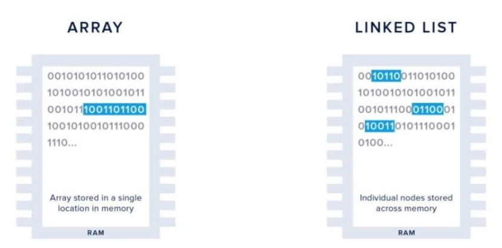

# **LINKED LIST**
********************

Como vemos en la imagen, a diferencia de los arrays el <b>Linked list</b> pueden ser almacenado en diferentes sectores de la
memoria, los cuales son referenciados por punteros.

## **CLASIFICACION LISTA ENLAZADAS**

#### LISTA SIMPLEMENTE ENLAZADA
- Eficientes ene recorridos directos.

#### LISTA DOBLEMENTE ENLAZADAS
- Eficiente en recorridos directos y hacia atras.

#### LISTA SIMPLEMENTE ENLAZADA
- El ultimos elemento se enlaza con el primer elemento, por ello hace un recorrido circular.

#### LISTA DOBLEMENTE  ENLAZADA
- El ultimos elemento se enlaza con el primer elemento, por ello hace un recorrido circular.
- El primer elemento se enlaza con el ultimo elemento.

## COMPLEJIDAD
***

|    Métodos    | Complejidad de tiempo | 
|:-------------:|:---------------------:|
| `push_front`  |         O(1)          |                
|  `push_back`  |         O(1)          |                   
|  `pop_front`  |         O(1)          |                   
|  `pop_back `  |         O(1)          |                   
|   `insert `   |         O(k)          |                   
|  `is_empty `  |         O(1)          |                   
|   `clear `    |         O(1)          |                   
|   `resize `   |         O(n)          |                   
|   `sort  `    |  O(nlogn) (mergeSort)  |                   
| `reverse  `   |         O(n)          |       

## COMENTARIOS ADICIONALES
***

- Para ejecutar el código y conocer las funcionalidades de los métodos, se utilizó `tester.h`.
- Se agregaron las complejidades de los métodos para determinar cuándo es conveniente utilizar CircularArray.
- No tienen un tamaño fijo (ventaja)
- Facil de realizar remover y agregar (ventaja).
- Ocupa mas espacio para cada uno de los elementos(desventaja).
- No es amigable con la memoria cache(desventaja).

